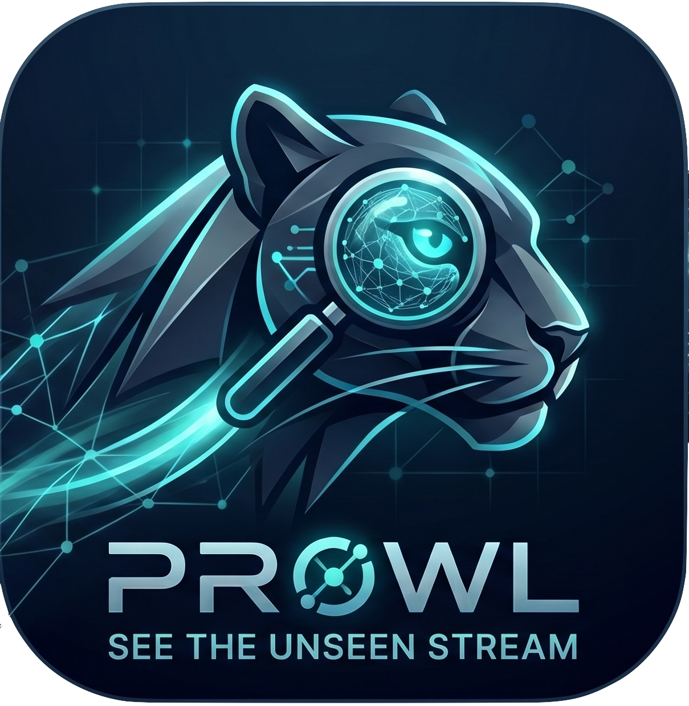

# Prowl

<p align="center">
  
</p>

<p align="center">
  <a href="https://github.com/elmeeee/Prowl/tags"></a>
  <a href="https://github.com/elmeeee/Prowl/actions/workflows/ci.yml"></a>
  
  
</p>

Prowl is a lightweight, high-performance network debugging library for the Apple ecosystem (`iOS`, `macOS`, `watchOS`, `tvOS`, `visionOS`) built with native `Foundation` + `SwiftUI` and distributed via Swift Package Manager.

## Features

- URL interception via `URLProtocol`
- Runtime logging toggle (pause/resume interception)
- Thread-safe log storage via `actor`
- FIFO log buffer (default `200`)
- Built-in sensitive data masking (toggleable at runtime)
- SwiftUI inspector dashboard + detail tabs
- Real-time search and status filtering
- URL ignore rules via substring and regex pattern
- Export logs as formatted text or cURL commands
- Activation shortcuts:
  - iOS shake gesture
  - macOS menu bar popover + `Command + Shift + P`

## Install (SPM)

In Xcode:

1. `File` -> `Add Package Dependencies...`
2. Enter your repository URL for Prowl
3. Select dependency rule version:
   - `Up to Next Major Version` (recommended), starting from the latest release
   - `Up to Next Minor Version`
   - `Exact Version` (locked)
4. Add the `Prowl` product to your app target

### Version Strategy Example

- **Stable updates (recommended):** `Up to Next Major` from the latest release tag
- **Strict lock for CI/release:** `Exact` to a specific release tag

If you use `Package.swift` directly, pin like this:

```swift
dependencies: [
    .package(url: "https://github.com/elmeeee/Prowl.git", exact: "<latest-release-tag>")
]
```

## Quick Start

### 1) Start interception

Call this once at app startup:

```swift
import Prowl

@main
struct DemoApp: App {
    init() {
        Prowl.start()
    }

    var body: some Scene {
        WindowGroup {
            ContentView()
        }
    }
}
```

### 2) Ignore Noise URLs (Optional)

If your app heavily pings telemetry or third-party analytics (like Firebase, Mixpanel, etc.), you can cleanly exclude them from cluttering your Prowl logs.

Pass an array of string partials directly when starting:

```swift
Prowl.start(ignoredURLs: [
    "https://firebaselogging.googleapis.com",
    "https://api.mixpanel.com/",
    "https://app-analytics-services.com/"
])
```

Alternatively, you can dynamically ignore URLs later at runtime:

```swift
Prowl.ignoreURL("https://res.cloudinary.com/")
Prowl.ignoreURL(regex: #"https://api\.example\.com/v[0-9]+/health"#)
```

You can also pass regex rules directly at startup:

```swift
Prowl.start(
    ignoredURLs: ["https://firebaselogging.googleapis.com"],
    ignoredURLRegexes: [#"https://api\.example\.com/internal/.*"#]
)
```

## Check Version

You can expose/log the package version in your app:

```swift
import Prowl

print("Prowl version:", Prowl.version)
```

### 3) Open the inspector

No extra view modifier is required.

After `Prowl.start()`:

- iOS: shake device to toggle inspector
- macOS: click the `Prowl` status bar icon and choose inspector actions from the popover panel

You can also control inspector manually (iOS/macOS):

```swift
Prowl.show()
Prowl.hide()
Prowl.toggle()
```

On macOS, `Prowl.start()` automatically installs a menu bar item so you can open/toggle the inspector without embedding a custom debug screen.

## Configure Storage and Masking

```swift
import Prowl
import ProwlCore

let storage = ProwlStorage(limit: 500)
let masker = SensitiveDataMasker(
    sensitiveHeaders: ["authorization", "cookie", "x-api-key"],
    sensitiveJSONKeys: ["password", "token", "accessToken"]
)

Prowl.configure(storage: storage, masker: masker)
Prowl.start()
```

### Sensitive Data Masking Toggle

Prowl can mask common secrets (for example `Authorization` bearer tokens, cookies, private keys, and common token/password JSON keys). Default is OFF.

You can toggle this at runtime:

```swift
import Prowl

Prowl.isSensitiveDataMaskingEnabled = false // default (show raw values)
Prowl.isSensitiveDataMaskingEnabled = true  // redact sensitive values
```

## Stream Request Body (Safe Path)

For requests that use `httpBodyStream`, attach a snapshot at request-build time so Prowl can log payload safely without mutating network transport:

```swift
import ProwlCore

var request = URLRequest(url: endpoint)
request.httpMethod = "POST"

let payload = try JSONEncoder().encode(body)
request.httpBodyStream = InputStream(data: payload)
request.attachProwlBodySnapshot(payload) // safe logging snapshot
```

Prowl follows a netfox capture path for stream-backed requests and falls back to attached snapshots when available.

### URLSession Integration (Automatic + Helpers)

Prowl now installs safe snapshot support at `Prowl.start()` time for:

- `URLSession.uploadTask(with:from:)`
- `URLSession.uploadTask(with:from:completionHandler:)`

That means payloads passed as `Data` are auto-snapshotted for logs without mutating transport behavior.

For streamed uploads, use helper APIs:

```swift
import ProwlCore

var request = URLRequest(url: endpoint)
request.httpMethod = "POST"

let payload = try JSONEncoder().encode(body)
request.setProwlHTTPBodyStream(payload) // stream + safe snapshot in one call

let task = URLSession.shared.prowlUploadTask(
    withStreamedRequest: request,
    bodySnapshot: payload
)
task.resume()
```

### Alamofire Integration

If you use Alamofire, plug in `ProwlAlamofireBodySnapshotInterceptor` so request bodies are snapshotted during adaptation:

```swift
import Alamofire
import ProwlCore

let session = Session(
    configuration: .default,
    interceptor: ProwlAlamofireBodySnapshotInterceptor()
)
```

### Moya Integration

If you use Moya, add `ProwlMoyaBodySnapshotPlugin` to provider plugins:

```swift
import Moya
import ProwlCore

let provider = MoyaProvider<MyTarget>(
    plugins: [ProwlMoyaBodySnapshotPlugin()]
)
```

## Toggle Logging at Runtime

```swift
import Prowl

Prowl.isLoggingEnabled = false // pause interception
Prowl.isLoggingEnabled = true  // resume interception
```

## Custom URLSessionDelegate (Pinning / mTLS)

You can provide your own `URLSessionDelegate` (for certificate pinning, mTLS, or custom trust handling):

```swift
final class MySessionDelegate: NSObject, URLSessionDelegate {
    // Implement trust / challenge handling here
}

Prowl.customSessionDelegate = MySessionDelegate()
Prowl.start()
```

## Export Logs

In the inspector toolbar:

- **Formatted Text** exports readable full entries
- **cURL Commands** exports executable requests for replay/debugging

Platform behavior:

- iOS uses `UIActivityViewController`
- macOS uses `NSSavePanel`

## Manual Inspector View

If you want to present the inspector yourself:

```swift
import SwiftUI
import ProwlUI

struct DebugPanelHost: View {
    var body: some View {
        ProwlInspectorView()
    }
}
```

## Example App

A complete usage example lives in:

```text
Example/Prowl-example
```

It includes:
- iOS tabs with live API traffic
- macOS menu bar inspector integration
- mock/edit flows and export actions

## Stop Interception

```swift
Prowl.stop()
```

## Notes

- Prowl uses native APIs only (no third-party dependencies).
- Log capture is designed to be idempotent and avoid side effects to host networking behavior.
- `URLProtocol` loop prevention is handled internally.
